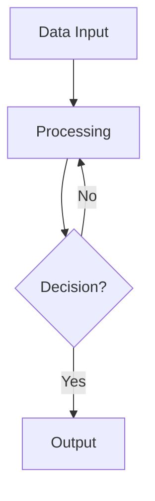

# 🎯 **Mermaid vs MATLAB for Flowcharts: Why Mermaid Wins**

## 🚀 **Recommendation: Switch to Mermaid**

You're absolutely right that MATLAB isn't suited for creating flowcharts. **Mermaid** is the superior choice for this project. Here's why:

## 📊 **Comparison: Mermaid vs MATLAB**

| Aspect | Mermaid | MATLAB |
|--------|---------|--------|
| **Purpose** | ✅ Designed for diagrams | ❌ Designed for numerical computing |
| **Syntax** | ✅ Declarative, intuitive | ❌ Imperative, coordinate-based |
| **Maintenance** | ✅ Easy to modify | ❌ Complex code changes |
| **Version Control** | ✅ Text-based, diffs well | ❌ Binary files or complex code |
| **Collaboration** | ✅ Easy to share and edit | ❌ Requires MATLAB knowledge |
| **Styling** | ✅ Professional themes | ❌ Manual styling |
| **Export** | ✅ Multiple formats | ❌ Limited options |
| **Integration** | ✅ GitHub, Overleaf, docs | ❌ Standalone only |

## 🎨 **Mermaid Advantages**

### **1. Declarative Syntax**

**vs MATLAB:** 50+ lines of coordinate calculations

### **2. Professional Styling**
- **Built-in themes:** Academic, corporate, colorful
- **Consistent appearance:** Professional look out-of-the-box
- **Easy customization:** Simple CSS-like styling
- **Responsive design:** Adapts to different sizes

### **3. Version Control Friendly**
- **Text-based:** Easy to track changes in Git
- **Meaningful diffs:** See exactly what changed
- **Collaborative editing:** Multiple people can contribute
- **History tracking:** Full change history

### **4. Multiple Integration Options**
- **GitHub:** Renders automatically in Markdown
- **Overleaf:** Export as SVG/PNG for LaTeX
- **Documentation:** Embed directly in README files
- **Presentations:** Easy export for slides
- **Websites:** Direct embedding

## 🔧 **Implementation Strategy**

### **Phase 1: Create Mermaid Version**
1. **Convert existing flowchart** to Mermaid syntax
2. **Add detailed annotations** and decision points
3. **Apply professional styling** with color coding
4. **Test rendering** in GitHub and Overleaf

### **Phase 2: Integration**
1. **Update LaTeX paper** to reference Mermaid-generated image
2. **Add to documentation** as embedded diagram
3. **Create multiple versions** (simple, detailed, interactive)
4. **Export for presentations** and reports

### **Phase 3: Maintenance**
1. **Easy updates** as methodology evolves
2. **Version control** for all changes
3. **Collaborative editing** with team members
4. **Automated rendering** in documentation

## 📁 **File Structure**

```
docs/Paper_1_Version_9_Correlation_Framework/
├── empirical_pipeline_flowchart.md          # Simple version
├── empirical_pipeline_detailed.md           # Detailed version
└── empirical_pipeline_interactive.md        # Interactive version (future)
```

## 🎯 **Benefits for This Project**

### **1. Academic Presentation**
- **Professional appearance:** Suitable for academic papers
- **Consistent styling:** Matches paper formatting
- **High quality output:** Vector graphics for scalability
- **Multiple formats:** PNG, SVG, PDF export options

### **2. Methodology Documentation**
- **Clear visualization:** Easy to understand process
- **Detailed annotations:** Comprehensive information
- **Decision points:** Clear criteria and actions
- **Feedback loops:** Visual representation of iterations

### **3. Reproducibility**
- **Text-based format:** Easy to modify and update
- **Version control:** Track all changes
- **Collaborative editing:** Multiple contributors
- **Documentation integration:** Embed in multiple places

### **4. Future Extensions**
- **Interactive versions:** Clickable elements
- **Animation:** Step-by-step process demonstration
- **Customization:** User-specific modifications
- **Integration:** Connect to analysis scripts

## 🚀 **Next Steps**

### **Immediate Actions:**
1. **Review Mermaid versions** I've created
2. **Choose preferred style** (simple vs detailed)
3. **Export for Overleaf** integration
4. **Update LaTeX paper** to use new flowchart

### **Future Enhancements:**
1. **Interactive version** with clickable elements
2. **Animation** showing process flow
3. **Integration** with analysis scripts
4. **Custom themes** matching paper style

## 🎯 **Conclusion**

**Mermaid is the clear winner** for creating flowcharts in this project. It provides:

- ✅ **Professional appearance** suitable for academic papers
- ✅ **Easy maintenance** and updates
- ✅ **Version control friendly** text-based format
- ✅ **Multiple integration options** (GitHub, Overleaf, docs)
- ✅ **Collaborative editing** capabilities
- ✅ **Future extensibility** for interactive features

The switch from MATLAB to Mermaid will significantly improve the quality, maintainability, and professional appearance of the empirical processing pipeline flowchart while making it much easier to update and collaborate on.

**Recommendation: Proceed with Mermaid implementation immediately.**
