# Detailed Empirical Processing Pipeline

## Main Processing Flow

```mermaid
flowchart TD
    %% Data Input Phase
    A[📊 Raw Data Collection<br/>• Professional rugby data<br/>• Multiple seasons<br/>• Team-level metrics<br/>• Match observations] --> B[🔧 Data Standardization<br/>• Normalization across scales<br/>• Unit conversion<br/>• Scale alignment<br/>• Format standardization]
    
    B --> C[✅ Quality Assessment<br/>• Completeness check<br/>• Consistency validation<br/>• Outlier detection<br/>• Data integrity verification]
    
    C --> D{❓ Quality<br/>OK?}
    D -->|❌ No| B
    D -->|✅ Yes| E[📈 Match-Level Aggregation<br/>• Team performance metrics<br/>• Match-specific calculations<br/>• Temporal alignment<br/>• Statistical summaries]
    
    %% Statistical Validation Phase
    E --> F[📊 Statistical Validation<br/>Pipeline]
    F --> G[📏 Normality Testing<br/>• Shapiro-Wilk test<br/>• Kolmogorov-Smirnov test<br/>• Anderson-Darling test<br/>• Distribution assessment]
    
    G --> H{📊 Normal<br/>Distribution?}
    H -->|❌ No| I[🔄 Data Transformation<br/>• Log-transformation<br/>• Box-Cox transformation<br/>• Power transformation<br/>• Distribution normalization]
    I --> G
    H -->|✅ Yes| J[🔗 Correlation Analysis<br/>• Pairwise deletion<br/>• Team pair matching<br/>• Correlation calculation<br/>• Statistical significance]
    
    J --> K[📐 Variance Structure<br/>Analysis<br/>• κ = σ²_B/σ²_A calculation<br/>• Variance ratio assessment<br/>• Competitive asymmetry<br/>• Distribution shape analysis]
    
    K --> L[📊 SNR Calculation<br/>• Absolute measure SNR<br/>• Relative measure SNR<br/>• Improvement ratio<br/>• Performance metrics]
    
    %% Framework Validation Phase
    L --> M[🎯 Framework Validation<br/>• Theoretical predictions<br/>• Mathematical model testing<br/>• Axiom verification<br/>• Framework applicability]
    
    M --> N[📈 Prediction Accuracy<br/>• Empirical vs theoretical<br/>• Correlation analysis<br/>• Residual analysis<br/>• Model validation]
    
    N --> O[🌐 Cross-Domain Validation<br/>• Multi-domain testing<br/>• Universal applicability<br/>• Domain-specific analysis<br/>• Generalization assessment]
    
    O --> P[📋 Results & Reports<br/>• Statistical summaries<br/>• Performance metrics<br/>• Framework validation<br/>• Implementation guidelines]
    
    %% Decision Points and Validation
    J --> Q{🔍 ρ > 0.05?}
    Q -->|❌ No| R[⚠️ Framework Not<br/>Applicable<br/>• Insufficient correlation<br/>• Alternative methods needed<br/>• Data quality issues<br/>• Environmental factors absent]
    Q -->|✅ Yes| K
    
    %% Additional Validation Steps
    M --> S[🛡️ Safety Constraints<br/>• Critical distance check<br/>• Parameter bounds<br/>• Mathematical stability<br/>• Framework limits]
    S --> T{🛡️ Safe<br/>Operation?}
    T -->|❌ No| U[⚠️ Parameter<br/>Adjustment<br/>• Reduce correlation<br/>• Adjust variance ratio<br/>• Modify framework<br/>• Alternative approach]
    U --> M
    T -->|✅ Yes| N
    
    %% Styling
    classDef dataInput fill:#e3f2fd,stroke:#1976d2,stroke-width:3px,color:#000
    classDef preprocessing fill:#fff8e1,stroke:#f57c00,stroke-width:3px,color:#000
    classDef analysis fill:#e8f5e8,stroke:#388e3c,stroke-width:3px,color:#000
    classDef validation fill:#fce4ec,stroke:#c2185b,stroke-width:3px,color:#000
    classDef output fill:#f3e5f5,stroke:#7b1fa2,stroke-width:3px,color:#000
    classDef decision fill:#fff9c4,stroke:#f9a825,stroke-width:3px,color:#000
    classDef error fill:#ffebee,stroke:#d32f2f,stroke-width:3px,color:#000
    classDef warning fill:#fff3e0,stroke:#ef6c00,stroke-width:3px,color:#000
    
    class A dataInput
    class B,C,E preprocessing
    class F,G,J,K,L analysis
    class M,N,O,S validation
    class P output
    class D,H,Q,T decision
    class I,U error
    class R warning
```

## Pipeline Statistics

| Phase | Stages | Key Metrics | Success Criteria |
|-------|--------|-------------|------------------|
| **Data Input** | 1 | Data completeness > 95% | All required fields present |
| **Preprocessing** | 3 | Quality score > 0.8 | Consistent data format |
| **Analysis** | 5 | Normality p > 0.05 | ρ > 0.05 for framework |
| **Validation** | 4 | Prediction r > 0.90 | All axioms satisfied |
| **Output** | 1 | Report completeness | All metrics calculated |

## Key Decision Points

### 1. **Quality Assessment (D)**
- **Criteria:** Data completeness, consistency, integrity
- **Threshold:** > 95% complete, < 5% outliers
- **Action:** Re-process if criteria not met

### 2. **Normality Testing (H)**
- **Criteria:** Shapiro-Wilk p > 0.05
- **Threshold:** Normal distribution assumption
- **Action:** Transform data if non-normal

### 3. **Correlation Validation (Q)**
- **Criteria:** ρ > 0.05
- **Threshold:** Framework applicability
- **Action:** Use alternative methods if insufficient

### 4. **Safety Constraints (T)**
- **Criteria:** Critical distance > 0.1
- **Threshold:** Mathematical stability
- **Action:** Adjust parameters if unsafe

## Expected Outcomes

- **Correlation Range:** ρ ∈ [0.086, 0.250]
- **SNR Improvements:** 9-31% across KPIs
- **Prediction Accuracy:** r = 0.96
- **Framework Validation:** All axioms satisfied
- **Cross-Domain Applicability:** Universal framework confirmed
