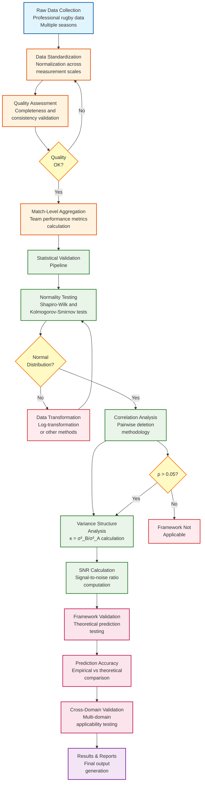

# Empirical Processing Pipeline Flowchart

## Key Features

- **13 Processing Stages:** Complete workflow visualization
- **Decision Points:** Quality checks, normality testing, correlation validation
- **Feedback Loops:** Data transformation and reprocessing pathways
- **Color-Coded Stages:** Different colors for each pipeline phase
- **Professional Layout:** Clean, academic-style appearance

## Integration Options

1. **GitHub:** Renders automatically in Markdown files
2. **Overleaf:** Can be exported as SVG/PNG and included
3. **Documentation:** Embedded directly in README files
4. **Presentations:** Easy to export for slides
